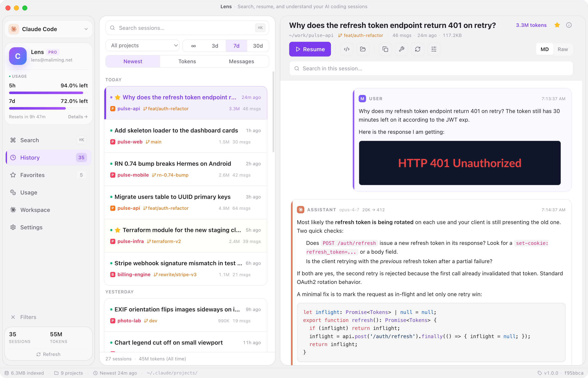
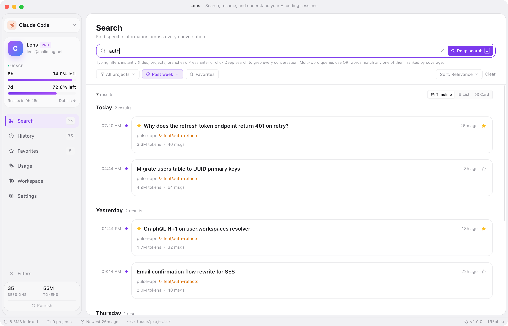
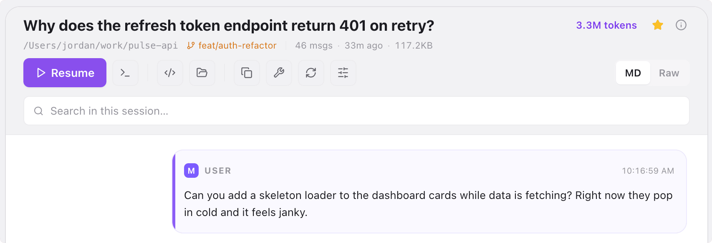
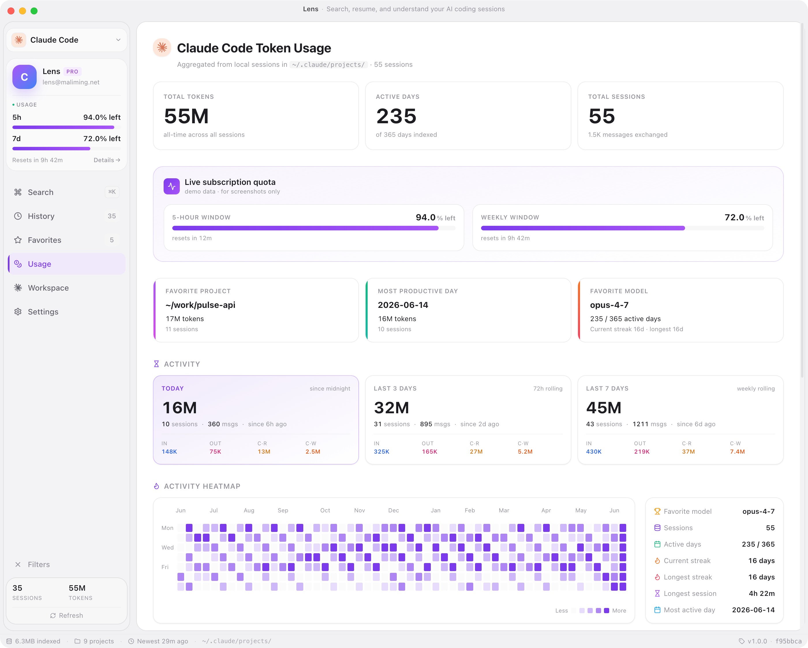
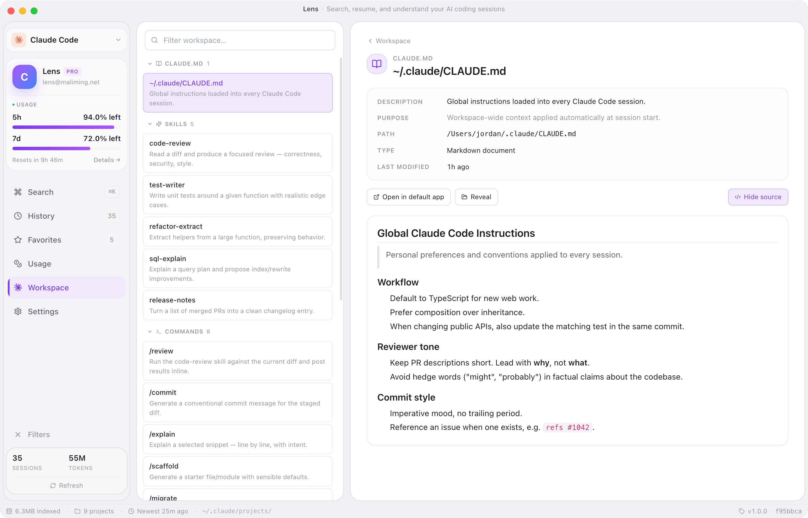
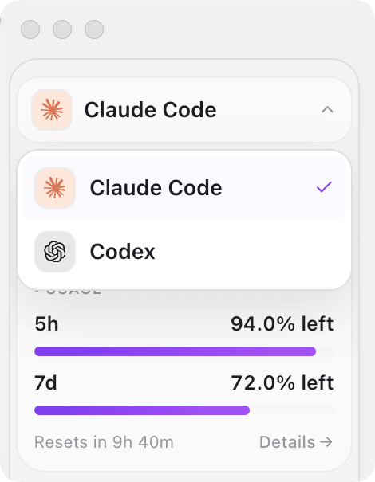
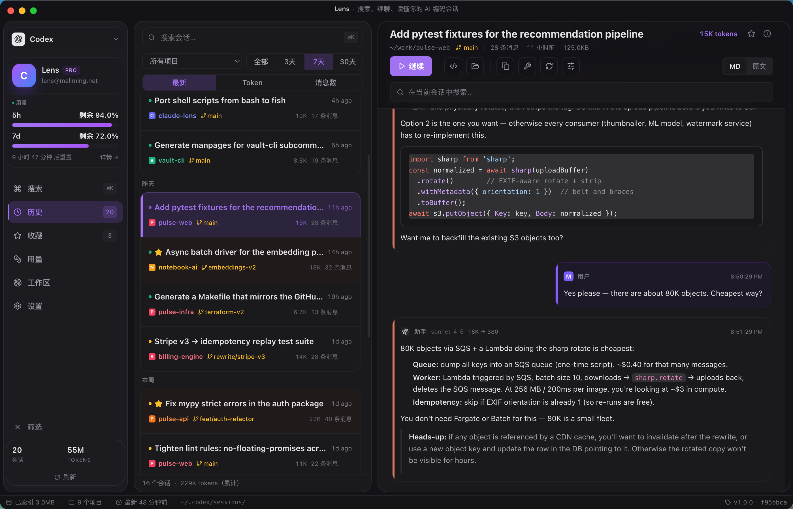

<div align="center">


# Lens

### One desktop app for both **Claude Code** and **OpenAI Codex** session history.

Search, resume, and understand every conversation either tool writes to disk — indexed locally, one click from continuing.

**[lens.maliming.net](https://lens.maliming.net)** &nbsp;·&nbsp; **[Download latest release](https://github.com/maliming/Lens/releases/latest)** &nbsp;·&nbsp; **[GitHub](https://github.com/maliming/Lens)**

[](https://github.com/maliming/Lens/releases/latest)
[](#install)
[](#install)
[](#license)
[](https://electronjs.org/)



</div>

---

## Why Lens

Claude Code and Codex stash every conversation as JSONL under `~/.claude/projects/` and `~/.codex/sessions/`. After a few weeks you've got **hundreds of sessions across dozens of repos** and no way to:

- Find the one where you fixed that auth bug last Tuesday
- See which model and project ate most of your tokens this week
- Get back into a half-finished refactor without remembering its UUID

Lens is the local-only browser that closes the loop.

---

## What it does

<table>
<tr>
<td width="55%"></td>
<td width="45%" valign="middle">

### 🔎 Search every conversation

Instant filter on title, project, branch, or model — and full-text grep through every JSONL body when the metadata isn't enough.

Switch between **list, card, or timeline** layouts; the timeline groups results by day so the moment you scroll, you remember which week you fixed what.

</td>
</tr>
<tr>
<td width="45%" valign="middle">

### ▶️ Resume in one click

Open the session in **Terminal or iTerm** at the original `cwd`, or copy the `claude --resume <id>` / `codex resume <id>` command to clipboard.

No remembering UUIDs. No `cd`-ing into the right repo first. Click → continue.

</td>
<td width="55%"></td>
</tr>
<tr>
<td width="55%"></td>
<td width="45%" valign="middle">

### 📊 Understand your token spend

Per-tool dashboards — rolling **5h / 24h / 7d / 30d** buckets, broken down by model and by project, with an activity heatmap and streak stats.

Live subscription quota optional: probe Anthropic with your Claude Code OAuth token to see real 5-hour and weekly remaining; Codex pulls limits from a local `codex app-server` JSON-RPC probe.

</td>
</tr>
<tr>
<td width="45%" valign="middle">

### 🗂️ Map your workspace

Browse `CLAUDE.md` / `AGENTS.md`, **Skills**, **Commands**, **Hooks** / Rules, **Plugins**, **Settings** — everything that shapes how the agent behaves, in one view.

Click any item to read the rendered Markdown or the raw config; jump to the file in Finder with one click.

</td>
<td width="55%"></td>
</tr>
<tr>
<td width="55%" align="center"></td>
<td width="45%" valign="middle">

### 🔁 Multi-tool, one app

Flip between **Claude Code** and **Codex** from the sidebar. Sessions, usage charts, workspace browser, plan badge, even per-tool favorites — all rescope to the active source.

Adding a future AI source is one row in the provider registry — no branching everywhere else.

</td>
</tr>
<tr>
<td width="45%" valign="middle">

### 🌗 Light, dark, ten languages

System / Light / Dark themes. UI localized into **English, 简体中文, Türkçe, 日本語, 한국어, Deutsch, Français, Español, Português (BR), Русский** — auto-detected from the system on first launch.

</td>
<td width="55%"></td>
</tr>
</table>

### And the small things that add up

- **Live subscription quota** — opt-in probe of the Claude Code OAuth token surfaces real 5h / 7d Anthropic remaining; Codex limits come from a local `codex app-server` JSON-RPC probe
- **Inline images** — pasted screenshots and tool-result attachments render in the conversation view; click for an in-app lightbox
- **Favorites, excludes, aliases** — stored per AI source, so Claude and Codex selections never collide
- **⌘K opens search** — full-text grep + title / project / branch / model filter in one keystroke
- **Tray / menu-bar resident** on macOS so the window can sleep without losing state
- **No network** — everything in the UI comes from local JSONL files; the live-quota probe is the one exception and is gated behind an explicit consent prompt

---

## Install

Grab the latest signed-or-unsigned artifact for your platform from the [GitHub Releases page](https://github.com/maliming/Lens/releases/latest), or build from source via the [Development](#development) section below.

> Builds are not yet signed with an Apple Developer ID / Windows Authenticode. First-launch warnings on macOS Gatekeeper and Windows SmartScreen are expected — instructions below.

<details>
<summary><b>macOS</b> &mdash; <code>.zip</code> (Apple Silicon or Intel)</summary>

Lens isn't signed with an Apple Developer ID — it's a free hobby project, macOS may refuse to open it on first launch with one of:

- "Lens can't be opened because the developer cannot be verified"
- "Lens is damaged and can't be opened. You should move it to the Trash." _(common on Apple Silicon — Gatekeeper's misleading wording for "quarantined + unsigned", not actual corruption)_

Strip the quarantine flag once and Lens launches normally from then on:

```bash
xattr -dr com.apple.quarantine "/Applications/Lens"
```

App data lives at `~/Library/Application Support/Lens/`.

</details>

<details>
<summary><b>Windows</b> &mdash; portable <code>.zip</code></summary>

Extract `Lens-<ver>-win.zip` anywhere and run `Lens.exe`. No installer, no admin rights needed. SmartScreen may show "Windows protected your PC" on first launch — click **More info** → **Run anyway**.

App data: `%APPDATA%\Lens\`

</details>


---

## Development

```bash
npm install
npm run dev
```

Boots the Vite dev server on `http://localhost:5173` and launches Electron pointing at it. DevTools opens automatically. Renderer hot-reloads; main-process edits (`electron/main.cjs`) need a full restart.

### Build & package

```bash
npm run build       # type-check + Vite build → dist/
npm run preview     # run Electron against built dist/

npm run dist:mac    # → release/Lens-<ver>-(arm64|x64)-mac.zip
npm run dist:win    # → release/Lens-<ver>-win.zip
```

Distribution defaults trim Chromium locales (English only) and enable maximum compression — a macOS DMG sits around 80 MB.

`DEMO_BUILD=1 npm run dist:mac` produces a screenshot-ready artifact with the fake-data layer locked on. Regular builds **never ship demo content** — the demo data module is swapped for an empty stub at build time via Vite alias.

---

## Tech stack

- **Electron 33** shell, CommonJS main process
- **Vite + React 18 + TypeScript** renderer
- **Tailwind CSS v3** with HSL CSS variables for theming
- **Radix UI** primitives + hand-written shadcn-style wrappers
- **lucide-react** for every icon, **marked** + **DOMPurify** for sanitized Markdown

A provider registry (`src/lib/sources.tsx`) keeps every AI-tool-specific bit (Claude vs Codex glyphs, path hints, workspace blurbs, plan-type adapters) in one place so adding a new AI source is one row in that file — no branching everywhere else.

See [`CLAUDE.md`](./CLAUDE.md) for the full architecture notes, IPC protocol, security model, and contributor guidelines.

---

## Repository layout

```
electron/    Main process + preload (Node, file IO, IPC)
src/         React renderer (no Node access)
build/       App icons + icon generation script
docs/        README assets (screenshots, GIFs)
release/     electron-builder output (gitignored)
CLAUDE.md    Architecture / contributor guide
```

---

## License

[MIT](./LICENSE) — Lens is a third-party browser for local Claude Code and Codex history files. Not affiliated with Anthropic or OpenAI.
